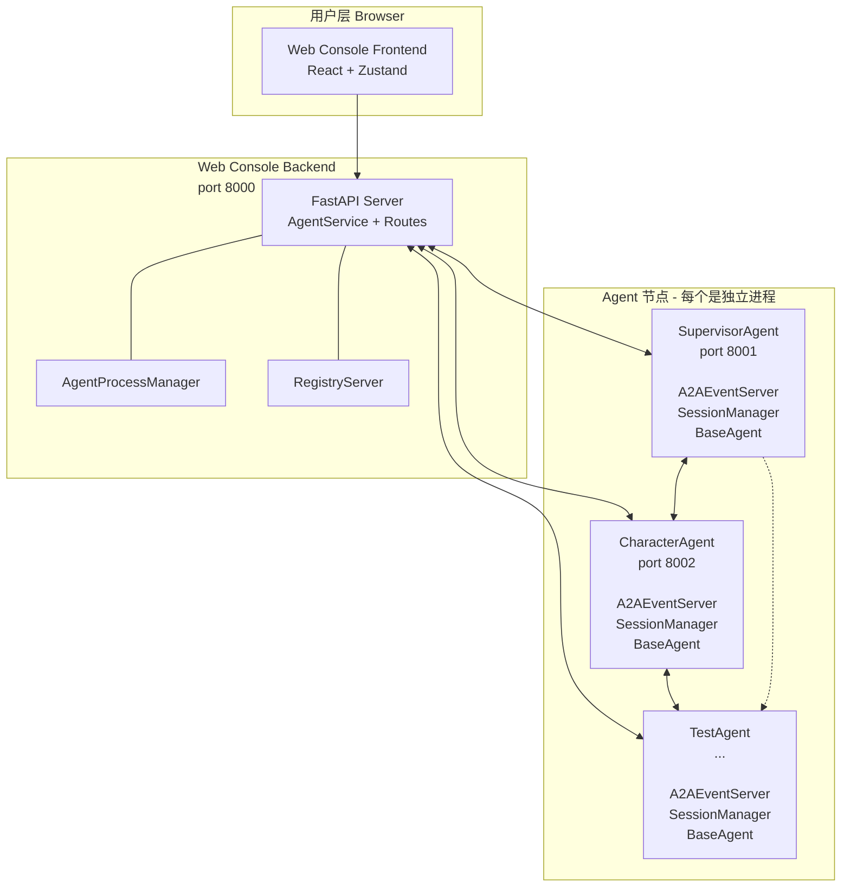

# NovelAgent - 多 Agent 协作系统

## 项目简介

NovelAgent 是一个基于 A2A（Agent-to-Agent）协议的多 Agent 协作系统，支持 Agent 生命周期管理、会话管理和流式对话交互。

---

## 项目架构



---

## 服务节点设计

### 1. Agent 节点（`core/a2a/routes.py`）

每个 Agent 独立进程，监听自己的端口，通过 A2A 协议通信：

```
┌─────────────────────────────────────────────────────────┐
│              Agent 节点 (e.g. SupervisorAgent)           │
│                                                          │
│  FastAPI App (独立端口, 如 8001)                        │
│                                                          │
│  GET  /.well-known/agent-card.json  → Agent 元信息       │
│  GET  /session/list               → 列出所有会话         │
│  GET  /session/{id}/history        → 会话历史消息         │
│  POST /session/new                → 新建会话             │
│  DELETE /session/{id}/delete      → 删除会话             │
│  PUT  /session/{id}/rename        → 重命名会话           │
│  POST /session/{id}/activate      → 激活会话            │
│  POST /chat/stream                → 流式对话 (SSE)       │
│  POST /a2a/event                 → A2A 事件处理 (SSE)   │
│  GET  /health                     → 健康检查              │
└─────────────────────────────────────────────────────────┘
```

**Session 状态机：**

```
创建 → active (同时只能有1个)  ──新建──→ 被挂起 → suspended
删除 → 激活最近更新的会话
```

**会话存储（JSONL）：**

```jsonl
{"type": "message", "role": "user", "content": "...", "timestamp": "..."}
{"type": "message", "role": "assistant", "content": "...", "tool_calls": [...], "timestamp": "..."}
{"type": "message", "role": "tool", "content": "...", "tool_call_id": "...", "timestamp": "..."}
{"type": "agent_request", "role": "user", "task": "...", "source_agent_id": "...", "event_id": "..."}
{"type": "agent_response", "role": "assistant", "content": "...", "target_agent_id": "...", "event_id": "..."}
```

---

### 2. Web Console 节点（`web_console/`）

统一网关，对前端暴露 REST API，对 Agent 节点代理转发：

```
┌─────────────────────────────────────────────────────────┐
│           Web Console Backend (port 8000)                │
│                                                          │
│  FastAPI Server                                          │
│                                                          │
│  Agent Routes (/api/agents)                              │
│  ├── GET  /api/agents                    → 列出所有 Agent │
│  ├── POST /api/agents                    → 创建/启动 Agent │
│  ├── POST /api/agents/{id}/suspend       → 挂起 Agent     │
│  ├── POST /api/agents/{id}/resume        → 恢复 Agent     │
│  └── DELETE /api/agents/{id}             → 删除 Agent     │
│                                                          │
│  Session Routes (/api/sessions)                          │
│  ├── GET  /api/sessions                   → 列出所有会话   │
│  ├── GET  /api/sessions/{id}              → 获取会话信息    │
│  ├── GET  /api/sessions/{id}/messages     → 获取消息历史  │
│  ├── POST /api/sessions/new               → 新建会话       │
│  ├── DELETE /api/sessions/{id}            → 删除会话       │
│  ├── PUT  /api/sessions/{id}/rename       → 重命名会话    │
│  └── POST /api/sessions/{id}/activate     → 激活会话      │
│                                                          │
│  Chat Routes                                             │
│  └── POST /chat/stream                   → 流式对话 (SSE) │
│                                                          │
│  Registry Routes (/api/registry)                           │
│  ├── POST /api/registry/register     → Agent 注册         │
│  └── GET  /api/registry/agents       → 查询已注册 Agents  │
└─────────────────────────────────────────────────────────┘
```

**AgentService** 内部逻辑：

```
list_agents()  → 遍历 FIXED_AGENTS → 检查 /health → 返回状态
create_agent() → AgentProcessManager.start_agent() → 启动子进程
chat_stream()  → 代理到 Agent 节点 /chat/stream
```

---

## 目录结构

```
NovelAgent/
├── agents/                          # Agent 实例配置
│   ├── supervisor_agent/            # 主控 Agent
│   │   ├── agent_config.json       # Agent 元信息
│   │   ├── cores/                 # Agent 类入口
│   │   ├── prompts/               # Prompt 模板
│   │   ├── skills/                # 技能目录（运行时加载）
│   │   └── sessions/               # 会话 JSONL 文件
│   ├── character_agent/
│   ├── theme_agent/
│   └── test_agent/
│
├── core/                           # 核心模块
│   └── a2a/                      # A2A 协议
│       ├── event_server.py       # A2A 事件服务器 (SSE)
│       ├── routes.py             # Agent HTTP 端点
│       ├── session.py            # SessionManager (JSONL)
│       ├── types.py              # A2AEvent, EventType
│       ├── client.py             # A2A 客户端
│       └── registry_server.py    # Agent 注册中心
│
│   └── base/                     # 基础组件
│       ├── agent_base.py         # BaseAgent 基类
│       ├── llm/                  # LLM 提供者 (OpenAI/Moonshot)
│       └── tools/                # 内置工具
│
├── web_console/                   # Web Console (统一网关)
│   ├── backend/
│   │   ├── main.py              # FastAPI 入口
│   │   ├── agent_service.py     # Agent 生命周期管理
│   │   ├── process_manager.py   # Agent 进程管理
│   │   ├── registry_service.py  # Agent 注册服务
│   │   ├── config.py            # FIXED_AGENTS 配置
│   │   └── routes/
│   │       ├── agents.py        # /api/agents
│   │       ├── sessions.py      # /api/sessions
│   │       ├── chat.py         # /chat/stream
│   │       └── registry.py      # /api/registry
│   │
│   └── frontend/                # React 前端
│       └── src/
│           ├── components/      # React 组件
│           │   ├── Sidebar/     # Agent 列表
│           │   ├── SessionPanel/# Session 管理
│           │   ├── Chat/       # 消息展示
│           │   └── Input/      # 输入框
│           └── features/        # Zustand Store
│               ├── agents/      # agentsStore + agentsApi
│               └── chat/      # chatStore + chatApi
│
├── business/                     # 业务工具服务
│   └── db/                      # MySQL 等
│
└── tests/                        # 测试
    ├── integration/              # 集成测试
    └── unit/                    # 单元测试
```

---

## 快速开始

### 前置依赖

```bash
pip install -r requirements.txt
node >= 18
```

### 环境变量

```env
# .env
OPENAI_API_KEY=your_api_key
OPENAI_API_BASE=https://api.moonshot.cn/v1
AGENT_DEBUG=true
```

### 启动

**1. 启动 Web Console（统一网关 + 前端）**

```bash
cd web_console/backend
python -m web_console.backend.main --debug
# 访问 http://localhost:8000
```

**2. 启动 Agent 节点（独立进程）**

```bash
cd agents/supervisor_agent
python -m core.a2a.run_agent \
    --agent-dir ./supervisor_agent \
    --port 8001 \
    --registry-endpoint http://localhost:8000
```

---

## Web Console 前端布局

```
┌──────────────────────────────────────────────────────────────────┐
│  Agents Sidebar │ Session Panel │        Header (Title + Status)  │
│  (可横向拉伸)     │  (可横向拉伸)   │                                  │
│                 │               │──────────────────────────────────│
│  [+][刷新]       │ [+][刷新][←]  │                                  │
│  ─────────      │ ─────────     │                                  │
│  🟢 Agent1      │  🟢 Sess1     │        消息列表                   │
│  🟢 Agent2      │  🟢 Sess2     │        (流式 SSE 渲染)            │
│                 │               │                                  │
│                 │               │──────────────────────────────────│
│                 │               │   ┌────────────────────────┐    │
│                 │               │   │  输入框 (圆角, 可纵向拉伸) │    │
│                 │               │   └────────────────────────┘    │
└─────────────────┴───────────────┴──────────────────────────────────┘
```

- **Agents Sidebar**：Agent 节点管理（启动/挂起/恢复/删除）
- **Session Panel**：当前 Agent 的会话管理（创建/激活/重命名/删除）
- **Chat Area**：消息展示 + 输入框

---

## 核心概念

### Session

每个 Agent 有多个 Session，互不干扰。同一时刻只有 1 个 Session 处于 `active` 状态，其他均为 `suspended`。

### A2A 协议

Agent 之间通过 `A2AEvent` 通信，支持 `TASK_REQUEST` / `TASK_RESPONSE` / `USER_MESSAGE` 等事件类型，基于 SSE 流式返回。

### 推理模式

使用 Moonshot Kimi k2.5 时，`temperature=1.0` 启用思考模式，`reasoning_content` 需手动注入到带 `tool_calls` 的 assistant 消息中。

---

## 测试

```bash
# 运行所有测试
python -m pytest tests/ -v

# 单元测试
python -m pytest tests/unit/ -v

# 集成测试（需要 Agent 节点运行）
python -m pytest tests/integration/ -v
```

---

## 添加新 Agent

1. 在 `agents/` 下创建目录结构（参考 `supervisor_agent/`）
2. 在 `web_console/backend/config.py` 的 `FIXED_AGENTS` 中添加配置
3. 在 `agents/{name}/cores/` 下实现 Agent 类（继承 BaseAgent）
4. 启动后 Web Console 会自动发现并显示该 Agent
