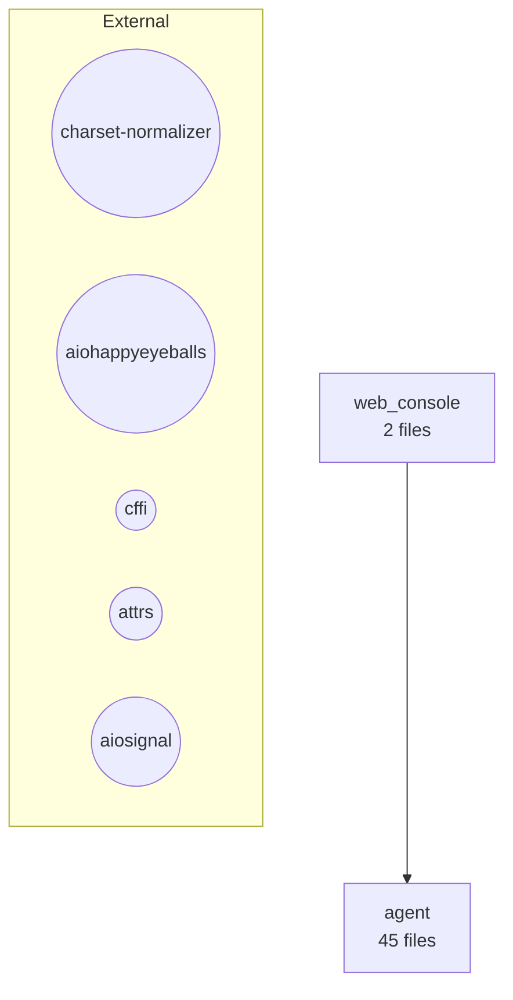
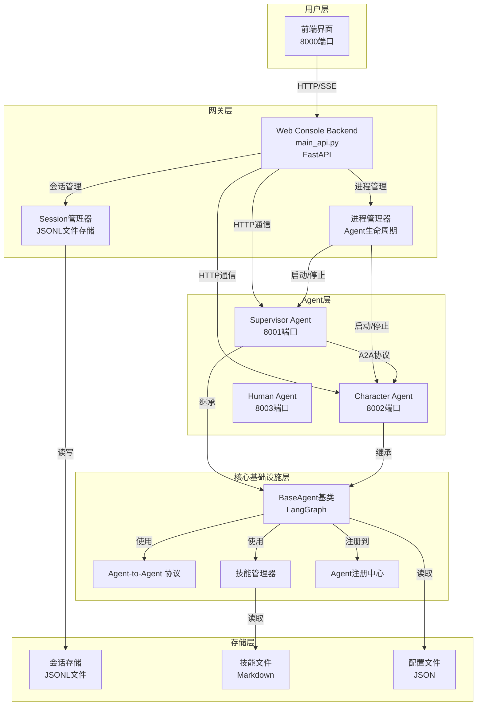
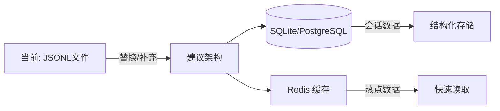
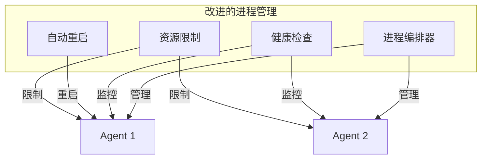
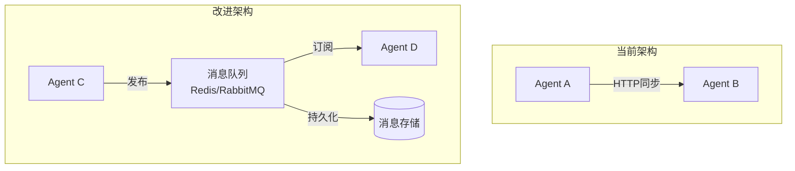

# NovelAgent 项目架构分析报告

## 0. 工具评估结果（使用senior-architect skill）

### 0.1 项目架构评估

```
ARCHITECTURE ASSESSMENT
========================

--- Architecture Pattern ---
Detected: Unstructured
Confidence: 0%

--- Code Issues (7个) ---
⚠️  agent/core/base/agent_base.py: 964行 (建议<500行)
⚠️  web_console/backend/main_api.py: 728行 (建议<500行)
⚠️  web_console/frontend/app.js: 845行 (建议<500行)
ℹ️  web_console/backend/main_api.py: 31个imports (建议<30个)
⚠️  agent/core/a2a/client_tools.py: A2AClient类 ~401行 (建议<300行)
⚠️  agent/core/session/manager.py: SessionManager类 ~321行 (建议<300行)
⚠️  agent/core/base/agent_base.py: BaseAgent类 ~659行 (建议<300行)

--- Recommendations ---
1. 采用清晰的架构模式（Layered/Clean/Hexagonal）
2. 拆分3个大类为更小的专注类
3. 重构3个大文件为更小的模块

--- Metrics ---
Total lines: 6150
File count: 47
Avg lines/file: 130
```

### 0.2 依赖分析

```
DEPENDENCY ANALYSIS REPORT
===========================

--- Summary ---
Direct dependencies: 75
Internal modules: 2
Coupling score: 50/100 (moderate)

--- Issues ---
⚠️  依赖数量较大（75个），建议审查未使用的依赖

--- Top Dependencies ---
- a2a-sdk: 0.3.26
- aiohttp: 3.13.5
- langchain相关
- fastapi
- openai
```

### 0.3 架构组件图



## 1. 架构概览



## 2. 架构优点

### 2.1 模块化设计
- ✅ **清晰的职责分离**：Agent层、Web Console层、业务层分离
- ✅ **可扩展性**：通过Agent工厂模式轻松添加新Agent
- ✅ **配置驱动**：Agent通过配置文件定义，无需硬编码

### 2.2 技术栈选择
- ✅ **FastAPI**：高性能、异步支持、自动文档
- ✅ **LangGraph**：适合Agent工作流编排
- ✅ **A2A协议**：自研的Agent间通信协议，灵活可控

### 2.3 多Agent协作
- ✅ **独立进程**：每个Agent运行在独立进程中，隔离性好
- ✅ **事件驱动**：基于事件的通信机制
- ✅ **技能系统**：支持渐进式技能披露

## 3. 架构问题与改进建议

### 3.1 存储架构问题

**当前状态：**
- 会话存储使用JSONL文件系统
- 无数据库支持
- 无缓存机制

**问题：**
- ⚠️ **可扩展性差**：文件系统不适合高并发场景
- ⚠️ **查询效率低**：无法进行复杂查询和索引
- ⚠️ **数据一致性**：多进程并发写入可能产生竞态条件
- ⚠️ **无备份机制**：数据丢失风险高

**改进建议：**


**具体方案：**
1. **短期**：引入SQLite作为本地数据库，保持轻量级
2. **中期**：添加Redis缓存层，提升读取性能
3. **长期**：考虑PostgreSQL支持分布式部署

### 3.2 进程管理问题

**当前状态：**
- 使用subprocess直接管理Agent进程
- 端口分配基于简单的递增逻辑
- 无进程监控和自动重启机制

**问题：**
- ⚠️ **单点故障**：Web Console Backend崩溃会导致所有Agent失联
- ⚠️ **资源泄漏**：进程异常退出可能导致端口未释放
- ⚠️ **无健康检查**：无法及时发现Agent故障
- ⚠️ **无资源限制**：Agent进程可能占用过多资源

**改进建议：**


**具体方案：**
1. 引入进程管理库（如supervisor或systemd）
2. 实现健康检查机制，定期ping Agent
3. 添加自动重启策略
4. 使用cgroups限制CPU/内存使用

### 3.3 A2A协议问题

**当前状态：**
- 自研A2A协议
- 基于HTTP的简单请求-响应模式
- 无消息队列支持

**问题：**
- ⚠️ **可靠性不足**：无消息持久化和重试机制
- ⚠️ **同步阻塞**：Agent间通信是同步的，可能阻塞
- ⚠️ **无消息队列**：无法处理高吞吐量场景
- ⚠️ **协议耦合**：协议与实现耦合度高

**改进建议：**


**具体方案：**
1. 引入消息队列（Redis Stream或RabbitMQ）
2. 实现异步消息处理
3. 添加消息确认和重试机制
4. 考虑采用标准协议（如gRPC或NATS）

### 3.4 会话管理问题

**当前状态：**
- 会话数据存储在JSONL文件中
- 每个Agent有独立的会话
- Agent间通信消息已支持记录

**问题：**
- ⚠️ **会话一致性**：多Agent会话之间缺乏统一视图
- ⚠️ **无会话迁移**：无法在Agent间迁移会话
- ⚠️ **无版本控制**：会话格式变更可能导致兼容性问题
- ⚠️ **无归档机制**：历史会话占用空间持续增长

**改进建议：**
1. 实现会话版本管理
2. 添加会话归档和压缩机制
3. 考虑跨Agent的会话关联
4. 实现会话快照功能

### 3.5 前端架构问题

**当前状态：**
- 简单的HTML/CSS/JavaScript
- 无前端框架
- 直接操作DOM

**问题：**
- ⚠️ **可维护性差**：代码复杂度增加后难以维护
- ⚠️ **用户体验**：缺乏现代化UI组件
- ⚠️ **状态管理**：无统一状态管理
- ⚠️ **测试困难**：无自动化测试

**改进建议：**
1. 引入现代前端框架（React/Vue）
2. 使用状态管理库（Redux/Pinia）
3. 添加组件库（Ant Design/Element Plus）
4. 实现自动化测试

## 4. 架构演进路线图

### 阶段1：短期改进（1-2个月）
- [ ] 引入SQLite数据库替代JSONL文件
- [ ] 实现进程健康检查
- [ ] 添加基础的错误处理和日志
- [ ] 完善文档

### 阶段2：中期改进（3-6个月）
- [ ] 引入Redis缓存层
- [ ] 实现消息队列（Redis Stream）
- [ ] 添加自动重启机制
- [ ] 前端重构（引入Vue/React）

### 阶段3：长期改进（6-12个月）
- [ ] 支持分布式部署
- [ ] 引入Kubernetes编排
- [ ] 实现多租户支持
- [ ] 添加监控和告警系统

## 5. 综合评估总结

### 5.1 工具评估关键发现

**架构模式**：
- ❌ 未识别到明确的架构模式（0%置信度）
- 建议：采用分层架构、整洁架构或六边形架构

**代码质量**：
- ⚠️ 7个代码问题需要关注
- 3个大文件（>500行）需要拆分
- 3个大类（>300行）需要拆分
- 违背单一职责原则

**依赖管理**：
- ⚠️ 75个直接依赖，数量偏多
- ✅ 耦合度适中（50/100）
- ✅ 无循环依赖

**项目规模**：
- 总代码行数：6150行
- 文件数量：47个
- 平均文件大小：130行（合理）

### 5.2 核心优势
1. ✅ 清晰的模块化设计
2. ✅ 灵活的Agent扩展机制
3. ✅ 自研A2A协议可控性强
4. ✅ 配置驱动降低耦合
5. ✅ 耦合度适中，无循环依赖

### 5.3 主要风险
1. ⚠️ 存储架构不适合生产环境
2. ⚠️ 进程管理缺乏可靠性
3. ⚠️ 无消息队列支撑高并发
4. ⚠️ 前端架构过于简单
5. ⚠️ 代码文件和类过大，维护性差
6. ⚠️ 依赖数量过多（75个）
7. ⚠️ 缺乏明确的架构模式

### 5.4 优先级建议
1. **P0（紧急）**：改进存储架构（SQLite） + 拆分大文件/类
2. **P1（重要）**：添加健康检查和自动重启 + 审查依赖
3. **P2（一般）**：引入消息队列 + 采用明确架构模式
4. **P3（可选）**：前端重构

总体而言，这是一个**设计思路清晰、模块化良好**的项目原型，但在**生产就绪性**和**代码可维护性**方面还有较大提升空间。建议按照上述路线图逐步改进。
